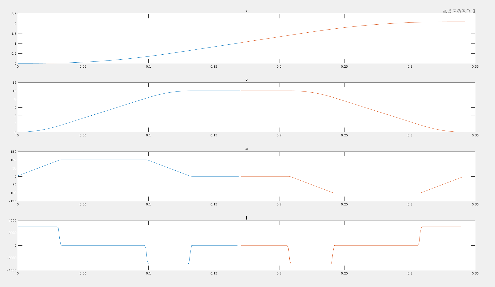

# motor_planner

```matlab
clear all;clc;close all;

theta_0 = deg2rad(0); 			% 电机初始角度 rad
theta_f = deg2rad(120);					% 电机终止角度 rad
theta_target = deg2rad(60) ;				% 射箭角度 rad
vel_target = 10;				% 射箭速度 rad/s
max_v = 10;						% 最大速度 rad/s
dt = 0.001;						% 离散时间

lfds_plan(theta_0, theta_f, theta_target, vel_target, max_v, dt)
```

